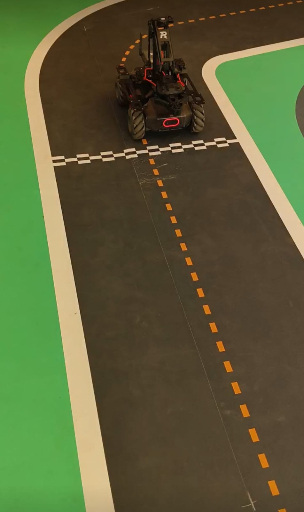

# MobileRobot-Openloopcontrol
## Aim:

To develop a python control code to move the mobilerobot along the predefined path.

## Equipments Required:
1. RoboMaster EP core
2. Python 3.7

## Procedure

Step1:


Measure the distance to be travelled by the mobilerobot in metres distance.

<br/>

Step2:


Accordingly give the x,y and z directions in .move() function from the ep_chassis.

<br/>

Step3:


Set the speed accordingly using xy_speed in .move() function.
<br/>

Step4:


Use r,g,b parameters in .set_led() to give the colour code for the mobilrobot.

<br/>

Step5:


Save the code and run it successfully.

<br/>

## Program
```python
from robomaster import robot
import time

if __name__ == '__main__':
    ep_robot = robot.Robot()
    ep_robot.initialize(conn_type="ap")

    ep_chassis = ep_robot.chassis

    ## Write your code here
from robomaster import robot
import time
from robomaster import camera

if __name__ == '__main__':
    ep_robot = robot.Robot()
    ep_robot.initialize(conn_type="ap")

    ep_chassis = ep_robot.chassis
    ep_led = ep_robot.led
    ep_camera = ep_robot.camera

    print("Video streaming started.....")
    ep_camera.start_video_stream(display=True, resolution = camera.STREAM_360P)

    ep_led.set_led(comp = "all",r=0,g=0,b=255,effect="on")

    ep_chassis.move(x=2.4, y=0, z=0, xy_speed=1.3).wait_for_completed()
    ep_led.set_led(comp = "all",r=0,g=255,b=0,effect="on")

    ep_chassis.move(x=0.5, y=0, z=80,xy_speed=1.3).wait_for_completed()
    ep_led.set_led(comp = "all",r=255,g=0,b=0,effect="on")

    ep_chassis.move(x=1, y=0, z=0, xy_speed=1.3).wait_for_completed()
    ep_led.set_led(comp = "all",r=255,g=215,b=0,effect="on")

    ep_chassis.move(x=0, y=-1.5, z=0, xy_speed=1.3).wait_for_completed()
    ep_led.set_led(comp = "all",r=255,g=215,b=0,effect="on")

    ep_led.set_led(comp = "all",r=128,g=0,b=128,effect="on")
    ep_chassis.move(x=0, y=0, z=55, xy_speed=1.3).wait_for_completed()

    ep_chassis.move(x=1.4, y=0, z=0, xy_speed=1.3).wait_for_completed()
    ep_led.set_led(comp = "all",r=255,g=102,b=0,effect="on")

    ep_chassis.move(x=0, y=0, z=45).wait_for_completed()
    ep_led.set_led(comp = "all",r=128,g=0,b=0,effect="on")

    ep_chassis.move(x=1.5, y=0, z=0,xy_speed=1.3).wait_for_completed()
    ep_led.set_led(comp = "all",r=51,g=153,b=102,effect="on")

    ep_chassis.move(x=0, y=0, z=95).wait_for_completed()
    ep_led.set_led(comp = "all",r=255,g=0,b=255,effect="on")

    ep_chassis.move(x=2, y=0, z=0,xy_speed=1.3).wait_for_completed()
    ep_led.set_led(comp = "all",r=0,g=204,b=255,effect="on")

    ep_chassis.move(x=0, y=0, z=85).wait_for_completed()
    ep_led.set_led(comp = "all",r=255,g=128,b=128,effect="on")

    ep_chassis.move(x=0.5, y=0, z=0,xy_speed=1.3).wait_for_completed()
    ep_led.set_led(comp = "all",r=0,g=0,b=128,effect="on")

    time.sleep(4)
    ep_camera.stop_video_stream()
    print("Stopped video streaming.....")

    ep_robot.close()


    
    ep_robot.close()
```

## MobileRobot Movement Image:





<br/>
<br/>
<br/>
<br/>

## MobileRobot Movement Video:

Upload your video in Youtube and paste your video-id here

https://youtu.be/bdMWdksryIo?si=DTuknk0s7pqs0AbX

<br/>
<br/>
<br/>
<br/>

## Result:
Thus the python program code is developed to move the mobilerobot in the predefined path.


<br/>
<br/>

```
Mobile Robotics Laboratory
Department of Artificial Intelligence and Data Science/ Machine Learning
Saveetha Engineering College
```
